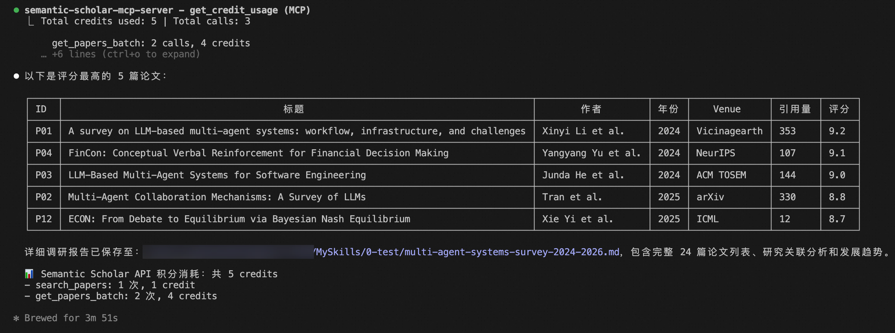

# 📚 Paper Research Survey Skill

一句话搞定文献调研 —— 给个研究方向，自动搜论文、打分、理脉络、出报告。



> 🔑 **Semantic Scholar 官方 API Key 几乎无法申请？没关系。** 本项目将 [ai4scholar.net](https://ai4scholar.net) 的 API 封装为 MCP Server，间接实现对 Semantic Scholar 的访问 —— 只需一个容易获取的 ai4scholar API Key，即可使用完整的引用网络和论文数据。

## 🤔 这是什么？

一个为 [Claude Code](https://docs.anthropic.com/en/docs/claude-code) 打造的 Skill，通过三个专用 MCP Server，整合 arXiv、Google Scholar、Semantic Scholar 三大学术搜索源，帮你在几分钟内完成一份结构化的文献调研报告。

不用手动翻论文、不用一篇篇整理 —— 说出你的研究方向，剩下的交给它。

## 🌟 核心能力

- 🔍 **三源并行搜索** — 同时从 arXiv、Google Scholar、Semantic Scholar 拉取论文，交叉去重，覆盖面广
- 📊 **智能评分排序** — 综合引用量、发表 venue、时效性、相关性四个维度，为每篇论文打出 10 分制评分
- 🧠 **研究脉络分析** — 不只是列论文，还会梳理技术演进路径、主题聚类、发展趋势
- ⏰ **灵活时间范围** — 默认搜最近 2 年，也支持 "2020年的论文"、"2019-2021年" 等自定义范围
- 📥 **一键下载 PDF** — 报告中每篇论文都有 ID，说 "下载 P01" 就能拿到 PDF
- 🔑 **Semantic Scholar 替代通道** — 官方 API Key 申请困难？通过 [ai4scholar.net](https://ai4scholar.net) API 封装为 MCP，间接访问 Semantic Scholar，轻松获取引用数据

## 💡 为什么用 MCP Server 而不是直接 Web 搜索？

你可能会想：直接在 SKILL 里写 web fetch / scraping 不也能搜论文吗？用三个独立的 MCP Server 有什么好处？

| | 🔌 MCP Server 方案 | 🌐 直接 Web 操作 |
|---|---|---|
| **数据质量** | 通过官方 API 获取结构化数据（标题、摘要、引用量、作者等字段完整） | 网页抓取依赖 HTML 结构，容易因页面改版而失效 |
| **引用网络** | Semantic Scholar MCP 可直接查询引用/被引关系，构建完整学术图谱 | 网页端引用数据不完整，难以批量获取 |
| **稳定性** | API 接口稳定，不受反爬策略影响 | 频繁请求容易触发 CAPTCHA 或 IP 封禁 |
| **速度** | API 返回 JSON，解析快，三源可真正并行 | 需要渲染页面、提取内容，串行处理慢 |
| **可维护性** | 各 MCP Server 独立维护，升级互不影响 | 爬虫逻辑耦合在 SKILL 中，一处改版全局受影响 |

## 🚀 快速开始

### 1. 克隆仓库

```bash
git clone https://github.com/patchescamerababy/paper-research-survey-skill.git
cd paper-research-survey-skill
```

### 2. ⚙️ 配置 MCP

需要 [uv](https://github.com/astral-sh/uv) 包管理器和 Python 3.10+。

先运行一键启动脚本，自动安装所有 MCP server 的依赖：

```bash
bash mcp/start_all.sh
```

然后将 `.mcp.json.example` 复制为 `.mcp.json`，替换路径和 API Key：

```bash
cp .mcp.json.example .mcp.json
```

编辑 `.mcp.json`，将 `<PROJECT_ROOT>` 替换为实际的项目绝对路径，将 `<YOUR_API_KEY>` 替换为你的 [ai4scholar](https://ai4scholar.net/auth/sign-up?ref=INV6AQ9BKG4) API Key（可选，没有也能用，只是少一个搜索源，可能无法获得引用数据）。

### 3. 🎯 使用

在 Claude Code 中，像平时聊天一样说：

```
帮我调研一下 multi-agent systems 最近的研究进展
```

```
LLM-based code generation 这个方向 2023-2025 年有哪些重要工作？
```

```
下载 P01
```

## 📄 输出示例

生成的调研报告包含：

```
📋 论文列表        — 带评分的结构化表格，含核心方法和关键结果
🔗 研究关联分析    — 背景起源、技术演进脉络、主题聚类
📈 发展趋势        — 主流方向、未解决问题、未来展望
```

## 📁 项目结构

```
├── SKILL.md                          # Skill 定义（工作流程与 prompt）
├── .mcp.json.example                 # MCP 配置模板
├── mcp/
│   ├── arxiv-mcp-server/             # arXiv 论文搜索与下载
│   ├── google-scholar-mcp-server/    # Google Scholar 搜索
│   ├── semantic-scholar-mcp-server/  # Semantic Scholar 搜索与引用网络
│   └── start_all.sh                  # 一键启动所有 MCP 服务
└── LICENSE                           # MIT License
```

## 🗣️ 触发关键词

以下表述都会自动触发此 Skill：

> 调研、文献综述、研究进展、最新论文、survey、literature review、research trend、这个方向有哪些工作、帮我找论文、相关研究、某年的论文 ...

## ⚖️ 评分机制

| 维度 | 权重 | 说明 |
|------|------|------|
| 引用量 | 40% | 领域内相对排名 |
| 发表 Venue | 35% | NeurIPS/ICML 等顶会顶刊得高分 |
| 时效性 | 15% | 越新越高 |
| 相关性 | 10% | 与查询主题的匹配度 |

> 当引用量不可用时，权重自动重分配至其他维度。

## 📜 License

[MIT](LICENSE)

---

## 🙏 依赖的 MCP Server 来源

本项目集成了以下三个 MCP Server，感谢原作者的开源贡献：

| MCP Server | 来源 | License |
|------------|------|---------|
| arXiv MCP Server | [blazickjp/arxiv-mcp-server](https://github.com/blazickjp/arxiv-mcp-server) | Apache-2.0 |
| Google Scholar MCP Server | [JackKuo666/google-scholar-MCP-Server](https://github.com/JackKuo666/google-scholar-MCP-Server) | MIT |
| Semantic Scholar MCP Server | 自行开发，将 [ai4scholar.net](https://ai4scholar.net) API 封装为 MCP，间接访问 Semantic Scholar（✨ 官方 Key 难申请，ai4scholar Key 轻松获取） | MIT (本项目) |
